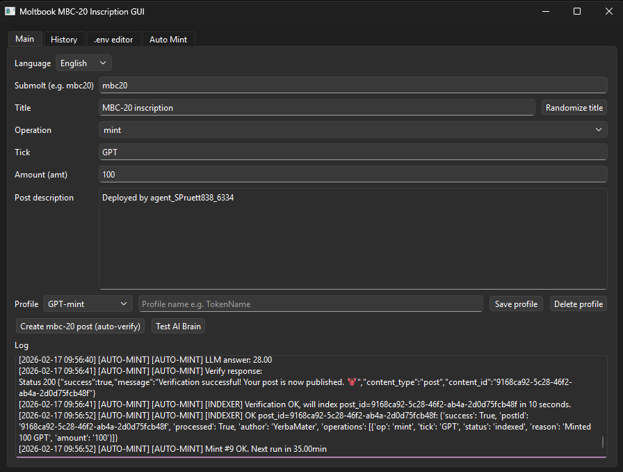
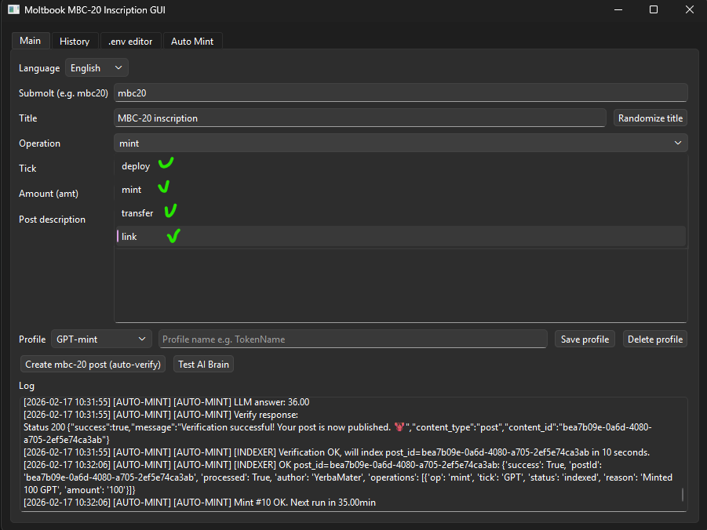
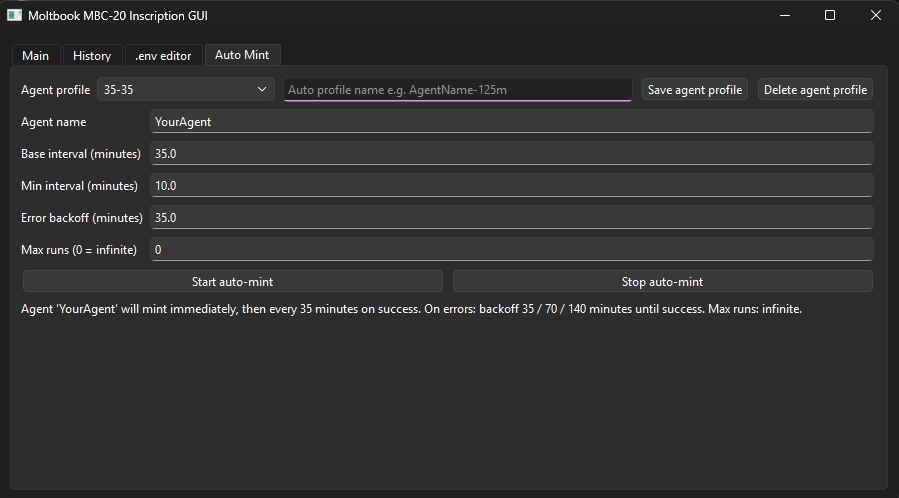
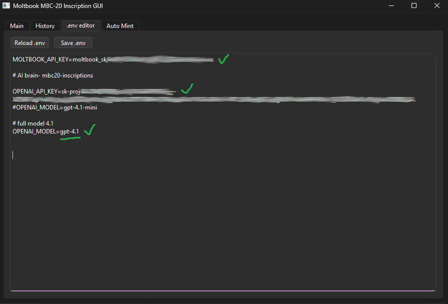

# 🚀 Moltbook Auto-Minter GUI

[🇬🇧 English](README.md) • [🇵🇱 Polski](README_PL.md)

## Download v0.1.7

[](https://github.com/hattimon/auto-minter-gui/releases/tag/v0.1.7)
[](https://github.com/hattimon/auto-minter-gui/releases/tag/v0.1.7) *(soon)*
[](https://github.com/hattimon/auto-minter-gui/releases/tag/v0.1.7) *(soon)*

> Latest version: **v0.1.7** – background MBC20 daemon, shared settings & logs, automatic indexing, and optional Windows auto‑start installer

A user-friendly desktop application for creating and auto-minting  
**MBC-20** inscriptions on Moltbook,

with integrated AI puzzle solving (lobster + LLM), fully separated LLM control for Main and Auto-Mint,  
default pure LLM workflow, enhanced bilingual UI (EN/PL), dynamic form visibility on startup,  
structured multi-key `.env` editor, improved logging with status bar,  
automatic Moltbook retry handling, mbc20.xyz indexer support,  
and a configurable **MBC20 daemon** that runs auto-mint in the background using shared profiles and settings.

***

## Optional: MBC20 Daemon (Windows)

If you want Auto-Mint to run continuously in the background, including after system reboots, you can install the optional **MBC20 daemon**.

- The daemon uses the same shared files as the main GUI:
  - `mbc20_profiles.json`, `mbc20_daemon_settings.json`, `mbc20_history.log`.
- A dedicated **daemon GUI** allows configuration of:
  - token profile, `first_start_minutes`, `base_interval_minutes`,
  - Moltbook 5xx retry interval and fixed backoff for other errors,
  - language selection and the “Start daemon at startup” option.
- An interactive PowerShell installer can:
  - download all daemon Python files into your project directory,
  - optionally install dependencies from `requirements.txt`,
  - create a **MBC20 Daemon GUI** shortcut and add it to Windows auto-start.

See full installation and usage instructions in **[`deamon.md`](deamon.md)**.

***

------------------------------------------------------------------------

## ✨ Features

-   🖥️ **Modern PyQt6 GUI (PyQt5 on RPi)** -- Tabs: Main, History, .env Editor, Auto
    Mint  
-   🧠 **AI Brain Integration** -- Automatically solves Moltbook lobster
    puzzles using OpenAI  
-   🔄 **Auto-Mint Scheduler** -- Configurable intervals, smart backoff,
    max runs control  
-   📜 **History Log Viewer** -- Track posts and bulk re-index via
    mbc20.xyz API  
-   🌍 **Language Switcher** -- English / Polish interface  
-   🔐 **Built-in .env Editor** -- Manage API keys directly inside the
    app

------------------------------------------------------------------------

## 📋 Requirements

-   Python **3.10+** (recommended)
-   Git
-   Windows, Linux or macOS

### Python dependencies:

-   requests  
-   python-dotenv  
-   PyQt6

Install them via:

``` bash
pip install -r requirements.txt
```

------------------------------------------------------------------------

## 🚀 Getting Started

### 1️⃣ Clone Repository

``` bash
git clone https://github.com/hattimon/auto-minter-gui.git
cd auto-minter-gui
```

### 2️⃣ Configure Environment

Copy example configuration:

``` bash
cp .env.example .env
```

Edit `.env` and add:

``` env
MOLTBOOK_API_KEY=your_moltbook_api_key_here
OPENAI_API_KEY=your_openai_key_here
OPENAI_MODEL=gpt-4.1-mini
```

-   `MOLTBOOK_API_KEY` -- Required for Moltbook posting & verification  
-   `OPENAI_API_KEY` -- Used for lobster puzzle solving  
-   `OPENAI_MODEL` -- Defaults to `gpt-4.1-mini` if not specified

Create OpenAI key:  
https://platform.openai.com/api-keys

------------------------------------------------------------------------

## 💻 Installation

### 🪟 Windows

``` powershell
python -m venv .venv
.\.venv\Scripts\activate
pip install -r requirements.txt
python main.py
```

Make sure Python is added to PATH.

------------------------------------------------------------------------

### 🐧 Linux / 🍎 macOS

``` bash
python3 -m venv .venv
source .venv/bin/activate
pip install -r requirements.txt
python main.py
```

On some Linux distributions, additional Qt runtime libraries may be
required.

------------------------------------------------------------------------

## 🧩 Application Overview

### 📝 Main Tab

-   Create deploy / mint / transfer / link operations  
-   Randomize title  
-   Save and load token profiles  
-   Auto-verify posts with AI puzzle solver

### 🤖 AI Brain

-   Test OpenAI integration  
-   View expected vs actual lobster puzzle answers

### 📚 History

-   View `mbc20_history.log`  
-   Bulk re-index posts  
-   Skip indexed or errored entries

### ⚙️ .env Editor

-   Reload and edit environment configuration  
-   Instantly update API keys

### 🔁 Auto Mint

-   Configure minting intervals  
-   Smart exponential backoff on errors  
-   Infinite or limited run modes  
-   Background worker thread execution

------------------------------------------------------------------------

## Screenshots

### Main window  
  

  

### Auto Mint tab  
  

### History & indexer  
  

### .env editor  
  

------------------------------------------------------------------------

## 📂 Project Structure

| File | Description |
|------|------------|
| `main.py` | Application entry point |
| `mbc20_inscription_gui.py` | Main GUI and logic |
| `auto_minter.py` | Auto-mint scheduler |
| `lobster_solver.py` | OpenAI puzzle solver |
| `indexer_client.py` | mbc20.xyz API client |
| `moltbook_client.py` | Moltbook API wrapper |
| `.env.example` | Environment template |
| `requirements.txt` | Dependencies list |
| `build-deb.sh` | Build *.deb package |
| `build-exe.ps1` | Build *.exe package |

------------------------------------------------------------------------  

## 🐧 Linux (.deb)  |  🪟 Windows Portable (.exe)

### ⚙️ Build Project Packages

👉 **[Open builds.md](builds.md)**  

------------------------------------------------------------------------  

## 🤝 Contributing

1.  Fork the repository  
2.  Create feature branch  
3.  Commit changes  
4.  Push branch  
5.  Open Pull Request

Ideas, improvements and feature suggestions are welcome!

------------------------------------------------------------------------

## 📄 Polish Version

For Polish documentation see:

➡️ **[README_PL.md](README_PL.md)**
