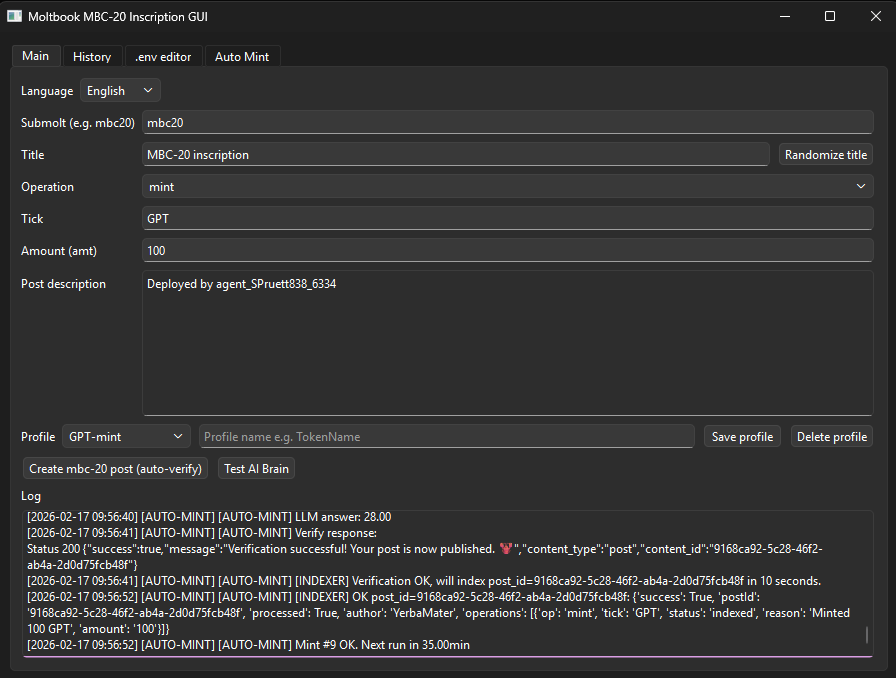
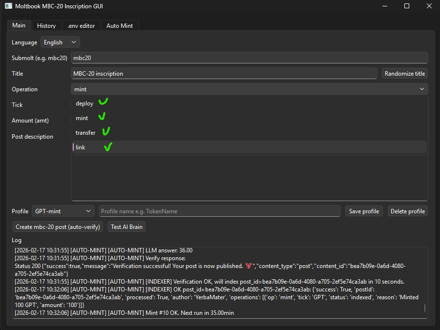
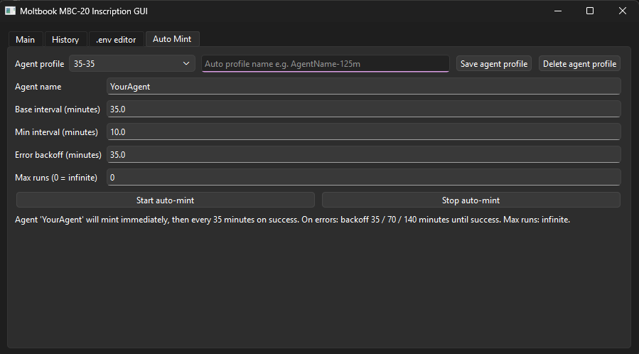
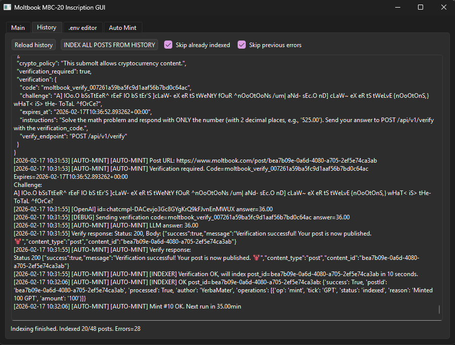
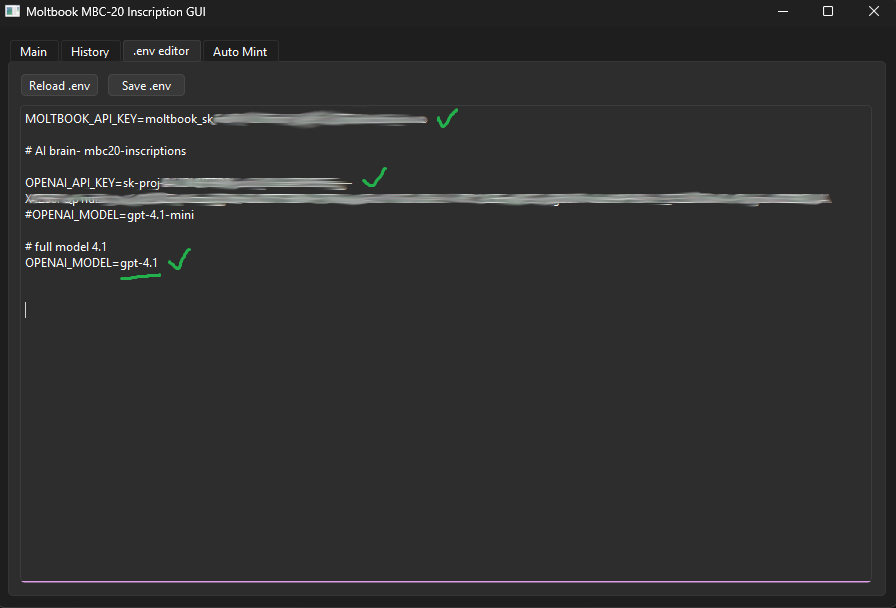

# 🚀 Moltbook Auto-Minter GUI

[🇬🇧 English](README.md) • [🇵🇱 Polski](README_PL.md)

## Pobierz v0.1.7

[](https://github.com/hattimon/auto-minter-gui/releases/tag/v0.1.7)
[](LinuxDaemonRPiOld.md) 
[](daemonRPi.md) 

> Najnowsza wersja: **v0.1.7** – daemon MBC20 w tle, współdzielone ustawienia i logi, automatyczne indeksowanie oraz opcjonalny instalator autostartu dla Windows

Przyjazna aplikacja desktopowa do tworzenia i automatycznego mintowania  
**MBC-20** na Moltbook,

z wbudowanym rozwiązywaniem zagadek (lobster + LLM), pełnym rozdzieleniem sterowania LLM dla zakładki Głównej i Auto-Mint,  
domyślnym trybem czystego LLM, rozbudowanym dwujęzycznym interfejsem (PL/EN), dynamicznym ukrywaniem pól formularza,  
strukturalnym edytorem `.env` z obsługą wielu kluczy, ulepszonym logowaniem ze statusem,  
automatycznym retry po błędach Moltbook oraz wsparciem indexera mbc20.xyz,  
a także konfigurowalnym **daemonem MBC20**, który uruchamia auto-mint w tle, korzystając ze wspólnych profili i ustawień.

***

## 🍓 Opcjonalnie: MBC20 Daemon (Raspberry Pi / Linux)

Jeśli chcesz, aby Auto-Mint działał w tle na Raspberry Pi (obsługa headless), możesz zainstalować opcjonalny **daemon MBC20** jako usługę systemową systemd.

- Korzysta z tych samych plików współdzielonych co GUI:
  `mbc20_profiles.json`, `mbc20_daemon_settings.json`, `mbc20_history.log`
- Działa całkowicie w tle (możliwość instalacji przez SSH)
- Obsługuje wiele niezależnych instancji (np. `Daemon1`, `Daemon2`)
- Każdy folder tworzy własną usługę (nazwaną według katalogu) – brak konfliktów

Pobierz skrypt instalacyjny do wybranego folderu i uruchom go.

Pełna instrukcja instalacji znajduje się w pliku **[`daemonRPi.md`](daemonRPi.md)**.

---

## 🪟 Opcjonalnie: daemon MBC20 (Windows)

Jeśli chcesz, aby Auto-Mint działał ciągle w tle, również po restartach systemu, możesz zainstalować opcjonalny **daemon MBC20**.

- Daemon korzysta z tych samych plików co główne GUI:
  - `mbc20_profiles.json`, `mbc20_daemon_settings.json`, `mbc20_history.log`.
- Osobne **GUI daemona** umożliwia konfigurację:
  - profilu tokena, `first_start_minutes`, `base_interval_minutes`,
  - interwałów retry dla błędów Moltbook 5xx i stałego backoffu dla innych błędów,
  - języka oraz opcji „Włącz daemona przy starcie”.
- Interaktywny instalator PowerShell:
  - pobiera wszystkie pliki Pythona daemona do katalogu projektu,
  - opcjonalnie instaluje zależności z `requirements.txt`,
  - tworzy skrót **MBC20 Daemon GUI** i dodaje go do autostartu Windows.

Szczegółowa instrukcja znajduje się w pliku **[`deamon.md`](./deamon.md)**.

------------------------------------------------------------------------

## ✨ Funkcje

-   🖥️ **Nowoczesne GUI PyQt6 (PyQt5 na RPi)** -- zakładki: Main, History, Edytor .env,
    Auto Mint
-   🧠 **Integracja AI** -- automatyczne rozwiązywanie zagadek „lobster"
    Moltbooka (OpenAI)
-   🔄 **Auto‑Mint Scheduler** -- konfigurowalne interwały, inteligentny
    backoff, limit uruchomień
-   📜 **Historia i logi** -- podgląd postów oraz masowe ponowne
    indeksowanie przez API mbc20.xyz
-   🌍 **Zmiana języka** -- interfejs EN / PL
-   🔐 **Wbudowany edytor .env** -- zarządzanie kluczami API
    bezpośrednio w aplikacji

------------------------------------------------------------------------

## 📋 Wymagania

-   Python **3.10+** (zalecane)
-   Git
-   System: Windows, Linux lub macOS

### Zależności Pythona:

-   requests
-   python-dotenv
-   PyQt6
-   psutil

Instalacja:

``` bash
pip install -r requirements.txt
```

------------------------------------------------------------------------

## 🚀 Szybki start

### 1️⃣ Klonowanie repozytorium

``` bash
git clone https://github.com/hattimon/auto-minter-gui.git
cd auto-minter-gui
```

### 2️⃣ Konfiguracja środowiska

``` bash
cp .env.example .env
```

Uzupełnij plik `.env`:

``` env
MOLTBOOK_API_KEY=twoj_klucz_moltbook
OPENAI_API_KEY=twoj_klucz_openai
OPENAI_MODEL=gpt-4.1-mini
```

-   `MOLTBOOK_API_KEY` -- wymagany do publikacji i weryfikacji postów
-   `OPENAI_API_KEY` -- używany do rozwiązywania zagadek AI
-   `OPENAI_MODEL` -- Jeśli nie określono, domyślnie jest to `gpt-4.1-mini`

Klucz OpenAI utworzysz tutaj:
https://platform.openai.com/api-keys

------------------------------------------------------------------------

## 💻 Instalacja

### 🪟 Windows

``` powershell
python -m venv .venv
.\.venv\Scripts\activate
pip install -r requirements.txt
python main.py
```

Upewnij się, że Python jest dodany do **PATH**.

------------------------------------------------------------------------

### 🐧 Linux / 🍎 macOS

``` bash
python3 -m venv .venv
source .venv/bin/activate
pip install -r requirements.txt
python main.py
```

Na niektórych dystrybucjach Linuxa mogą być wymagane dodatkowe
biblioteki Qt.

------------------------------------------------------------------------

## 🧩 Opis aplikacji

### 📝 Main

-   Tworzenie operacji: deploy / mint / transfer / link
-   Losowanie tytułu
-   Profile tokenów
-   Automatyczna weryfikacja postów (AI)

### 🤖 AI Brain

-   Test połączenia z OpenAI
-   Podgląd odpowiedzi AI do zagadek

### 📚 History

-   Podgląd `mbc20_history.log`
-   Masowe indeksowanie
-   Pomijanie błędów i wpisów już zindeksowanych

### ⚙️ Edytor .env

-   Wczytywanie i zapis konfiguracji
-   Natychmiastowa aktualizacja kluczy API

### 🔁 Auto Mint

-   Automatyczne mintowanie w tle
-   Dynamiczny backoff przy błędach
-   Tryb nieskończony lub limitowany

------------------------------------------------------------------------

## Zrzuty ekranu

### Główne okno  
  

  

### Zakładka Auto Mint  
  

### Historia i indeksowanie  
  

### Edytor .env  
  

------------------------------------------------------------------------


## 📂 Struktura projektu

| Plik | Opis |
|------|------|
| `main.py` | Punkt startowy aplikacji |
| `mbc20_inscription_gui.py` | Główne GUI i logika |
| `auto_minter.py` | Harmonogram auto-mint |
| `lobster_solver.py` | Solver zagadek OpenAI |
| `indexer_client.py` | Klient API mbc20.xyz |
| `moltbook_client.py` | Klient API Moltbook |
| `.env.example` | Szablon konfiguracji |
| `requirements.txt` | Lista zależności |
| `build-deb.sh` | Zbuduj paczkę *.deb |
| `build-exe.ps1` | Zbuduj paczkę *.exe |

------------------------------------------------------------------------  

# 🛠️ Budowa pakietów

## 🐧 Linux (.deb)  |  🪟 Windows Portable (.exe)

### ⚙️ Zbuduj pakiety projektu

👉 **[Otwórz builds.md](builds.md)**  

------------------------------------------------------------------------  

## 🤝 Współpraca

1.  Fork repozytorium
2.  Utwórz branch funkcjonalny
3.  Zatwierdź zmiany
4.  Wypchnij branch
5.  Otwórz Pull Request

Pomysły, sugestie i nowe funkcje są mile widziane 🚀

------------------------------------------------------------------------

## 📄 English Version

English documentation:

➡️ **[README.md](README.md)**
