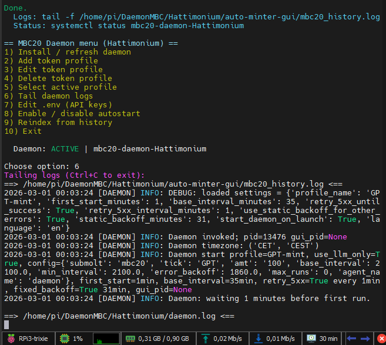
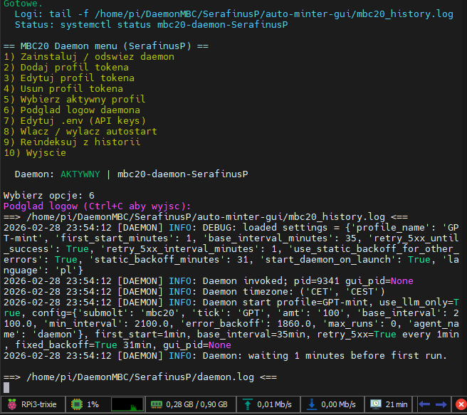

**Choose language / Wybierz język:**  
👉 [English](#english)   👉 [Polski](#polski)  

---

# 🇬🇧 English Version

<a id="english"></a>

# 🍓 daemonRPi – Installation and Configuration (Multi-Instance)

Installer script:  
https://github.com/hattimon/auto-minter-gui/blob/main/scripts/rpdaemon.sh   



## 🧠 Overview

-   Tested on Raspberry Pi 3 (Raspbian Trixie -- headless)
-   Works on Raspberry Pi 2 / 4 / Zero
-   Low hardware requirements
-   Supports multiple instances (Daemon1, Daemon2, etc.)
-   Each folder creates its own system service
-   No conflicts between instances

------------------------------------------------------------------------

# 📂 Install in Any Folder

Do NOT clone the entire repository. Download only the script into your
target application folder.

------------------------------------------------------------------------

## 🔹 Example -- First Instance (Daemon1)

    mkdir Daemon1
    cd Daemon1
    wget https://raw.githubusercontent.com/hattimon/auto-minter-gui/main/scripts/rpdaemon.sh
    chmod +x rpdaemon.sh
    sudo ./rpdaemon.sh

------------------------------------------------------------------------

## 🔁 Second Instance (Daemon2)

    mkdir Daemon2
    cd Daemon2
    wget https://raw.githubusercontent.com/hattimon/auto-minter-gui/main/scripts/rpdaemon.sh
    chmod +x rpdaemon.sh
    sudo ./rpdaemon.sh

Result: - Independent system service named after folder - No service
conflicts - Multiple daemons can run simultaneously

------------------------------------------------------------------------

### 🔍 Service Management (All Instances)

You can manage a single instance or all `mbc20-daemon-*` services.

```bash
# List all daemon services (active + inactive)
systemctl list-units "mbc20-daemon-*.service" --all

# Check one specific instance (example: folder Daemon1)
sudo systemctl status mbc20-daemon-Daemon1.service

# Start / stop / restart one instance
sudo systemctl start   mbc20-daemon-Daemon1.service
sudo systemctl stop    mbc20-daemon-Daemon1.service
sudo systemctl restart mbc20-daemon-Daemon1.service

# Follow logs of one instance
journalctl -u mbc20-daemon-Daemon1.service -f

# Show all running daemon Python processes
ps aux | grep mbc20_auto_daemon.py | grep -v grep
```

------------------------------------------------------------------------

# 🖥️ Runtime Mode

-   OS: Raspbian (Trixie tested)
-   Headless compatible
-   SSH installation supported
-   Runs fully in background

***

# 🍓 daemonRPi -- Instalacja i konfiguracja (Wiele instancji)

Skrypt instalacyjny:
https://github.com/hattimon/auto-minter-gui/blob/main/scripts/rpdaemon_pl.sh   



# 🇵🇱 Wersja Polska

<a id="polski"></a>

## 🧠 Informacje

-   Testowane na Raspberry Pi 3 (Raspbian Trixie -- headless)
-   Działa również na Raspberry Pi 2 / 4 / Zero
-   Niskie wymagania sprzętowe
-   Obsługa wielu instancji (Daemon1, Daemon2, itd.)
-   Każdy folder = osobna usługa systemowa
-   Brak konfliktów między instancjami

------------------------------------------------------------------------

# 📂 Instalacja w dowolnym folderze

Nie klonujemy całego repozytorium. Pobieramy wyłącznie skrypt do
docelowego katalogu aplikacji.

------------------------------------------------------------------------

## 🔹 Przykład -- pierwsza instancja (Daemon1)

### 1️⃣ Utworzenie katalogu

    mkdir Daemon1
    cd Daemon1

### 2️⃣ Pobranie skryptu

    wget https://raw.githubusercontent.com/hattimon/auto-minter-gui/main/scripts/rpdaemon_pl.sh

### 3️⃣ Nadanie uprawnień

    chmod +x rpdaemon_pl.sh

### 4️⃣ Instalacja

    sudo ./rpdaemon_pl.sh

------------------------------------------------------------------------

## ⚙️ Co robi skrypt?

-   Instaluje wymagane zależności
-   Tworzy usługę systemd
-   Włącza autostart
-   Nadaje nazwę usługi na podstawie folderu (np. Daemon1)

------------------------------------------------------------------------

# 🔁 Druga instancja (Daemon2)

    mkdir Daemon2
    cd Daemon2
    wget https://raw.githubusercontent.com/hattimon/auto-minter-gui/main/scripts/rpdaemon_pl.sh
    chmod +x rpdaemon_pl.sh
    sudo ./rpdaemon_pl.sh

Efekt: - Powstaje niezależna usługa systemowa Daemon2 - Brak konfliktu z
Daemon1 - Obie instancje działają równolegle

------------------------------------------------------------------------

### 🔍 Zarządzanie usługami (wszystkie instancje)

Możesz zarządzać pojedynczą instancją lub wszystkimi usługami `mbc20-daemon-*`.

```bash
# Lista wszystkich usług daemona (aktywne + nieaktywne)
systemctl list-units "mbc20-daemon-*.service" --all

# Status konkretnej instancji (przykład: katalog Daemon1)
sudo systemctl status mbc20-daemon-Daemon1.service

# Start / stop / restart jednej instancji
sudo systemctl start   mbc20-daemon-Daemon1.service
sudo systemctl stop    mbc20-daemon-Daemon1.service
sudo systemctl restart mbc20-daemon-Daemon1.service

# Podgląd logów jednej instancji
journalctl -u mbc20-daemon-Daemon1.service -f

# Aktualnie uruchomione procesy daemona
ps aux | grep mbc20_auto_daemon.py | grep -v grep
```

------------------------------------------------------------------------

# 🖥️ Tryb pracy

-   System: Raspbian (Trixie testowane)
-   Tryb: Headless
-   Instalacja przez SSH możliwa
-   Działa w tle jako daemon

